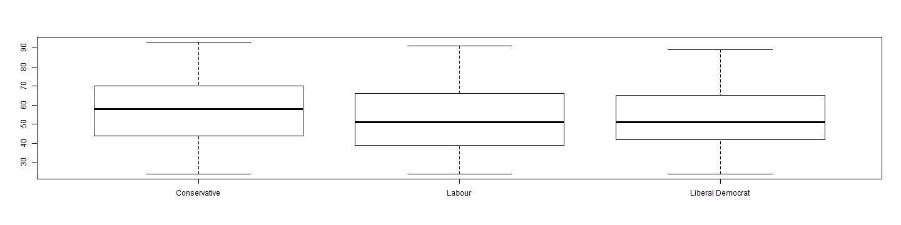

presentation Data Analysis
========================================================
author: 
date: 
autosize: true

<style>
.small-code pre code {
  font-size: 1em;
}
</style>

we chose as dataset a british panel of voters from 1997-2001
========================================================


```r
library(carData)
summary(BEPS)
```

```
               vote          age        economic.cond.national
 Conservative    :462   Min.   :24.00   Min.   :1.000         
 Labour          :720   1st Qu.:41.00   1st Qu.:3.000         
 Liberal Democrat:343   Median :53.00   Median :3.000         
                        Mean   :54.18   Mean   :3.246         
                        3rd Qu.:67.00   3rd Qu.:4.000         
                        Max.   :93.00   Max.   :5.000         
 economic.cond.household     Blair           Hague          Kennedy     
 Min.   :1.00            Min.   :1.000   Min.   :1.000   Min.   :1.000  
 1st Qu.:3.00            1st Qu.:2.000   1st Qu.:2.000   1st Qu.:2.000  
 Median :3.00            Median :4.000   Median :2.000   Median :3.000  
 Mean   :3.14            Mean   :3.334   Mean   :2.747   Mean   :3.135  
 3rd Qu.:4.00            3rd Qu.:4.000   3rd Qu.:4.000   3rd Qu.:4.000  
 Max.   :5.00            Max.   :5.000   Max.   :5.000   Max.   :5.000  
     Europe       political.knowledge    gender   
 Min.   : 1.000   Min.   :0.000       female:812  
 1st Qu.: 4.000   1st Qu.:0.000       male  :713  
 Median : 6.000   Median :2.000                   
 Mean   : 6.729   Mean   :1.542                   
 3rd Qu.:10.000   3rd Qu.:2.000                   
 Max.   :11.000   Max.   :3.000                   
```

Slide With Code and plot
========================================================
We plot the age and age

```r
library(shiny)
library(carData)

plot(BEPS[,"vote"],BEPS[,"age"])
```



Slide with plot
========================================================
pie chart of vote repartition


Slide with link https://myshinyappra.shinyapps.io/dataAnalysis/
========================================================
plot of gender and vote

